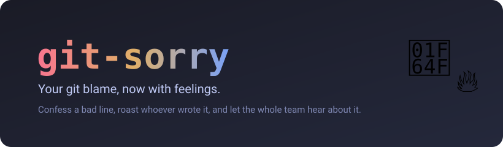
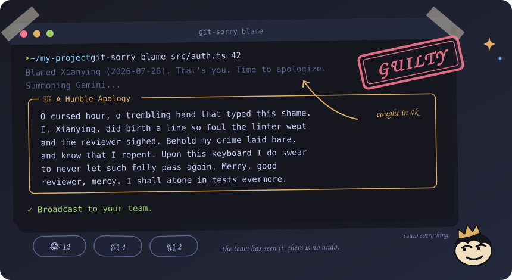
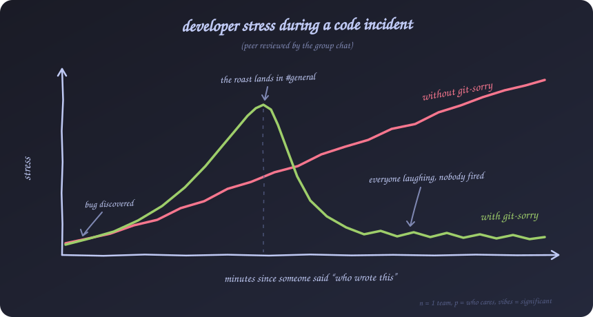

<p align="center">
  
</p>

<h3 align="center">Your git blame, now with feelings.</h3>

<p align="center">
  Blame a line of code, let AI write the apology or the roast,<br>
  then drop it straight into your team's Slack or Discord.
</p>

<p align="center">
  <a href="https://www.npmjs.com/package/git-sorry"></a>
  
  
  
  
</p>

## Try it in 30 seconds

No install, no webhook, no commitment. Grab a free Gemini key from
[Google AI Studio](https://aistudio.google.com/app/apikey), then point it at the
worst line in your repo:

```bash
npx git-sorry config --set-key <GEMINI_API_KEY>
npx git-sorry blame src/auth.ts 42 --dry-run
```

`--dry-run` prints the verdict in your terminal and tells nobody. Remove it once
you are ready to involve the whole team.

<p align="center">
  
</p>

<p align="center"><sub>An unedited run. The roast is whatever Gemini came up with that afternoon.</sub></p>

## What it does


We have all shipped a line of code we are not proud of. `git-sorry` finds out
who wrote it and turns the moment into a bit of theatre.

Point it at a file and a line number. It reads `git blame`, figures out whether
the culprit is you or a teammate, and asks Gemini to write the appropriate
response. If the line is yours, you get a dramatic apology worthy of the stage.
If it belongs to someone else, you get a playful roast that gently demands an
explanation. Either way the message lands in a tidy box in your terminal and
goes straight to your team on Slack or Discord.

It is a joke tool with a real workflow underneath. Bring your own keys, keep
them on your machine, and let the drama begin.

The character on the right is **Snitchy**, the project mascot. Snitchy reads
`git blame` so it can tell everyone, points at whoever wrote the line, and has
never once felt bad about it. Ten percent remorse, ninety percent main
character. Every `blame` you run keeps Snitchy fed.

<br clear="right">

## When the bad line is yours

<p align="center">
  
</p>

## Install

```bash
npm install -g git-sorry
```

Or skip the install entirely and prefix every command with `npx`. Node 18 or
newer, and a git repository with some history to blame.

## Set it up

You need a Gemini API key, and a webhook URL only if you want the message to
leave your machine. Both are stored in `~/.git-sorry/config.json` with owner
only permissions.

```bash
git-sorry config --set-key <GEMINI_API_KEY>
git-sorry config --set-webhook <SLACK_OR_DISCORD_WEBHOOK_URL>
```

Where to find them:

| Item | Where |
| :--- | :--- |
| Gemini API key | https://aistudio.google.com/app/apikey |
| Slack webhook | `https://hooks.slack.com/services/...` |
| Discord webhook | `https://discord.com/api/webhooks/...` |

## Use it

```bash
git-sorry blame <filepath> <line_number>
```

For example, to put line 42 of `src/auth.ts` on trial:

```bash
git-sorry blame src/auth.ts 42
```

If you wrote the line, expect an apology. If a teammate did, expect a roast.
The generated message prints in your terminal and posts to your chat at the
same time.

A few flags for when you want the last word:

| Flag | What it does |
| :--- | :--- |
| `--dry-run` | Print the message but keep it off the team channel. Handy for a first look, and it works without a webhook set. |
| `--roast` | Roast the author no matter who wrote the line. |
| `--apology` | Grovel instead, even if the line was not yours. |

```bash
git-sorry blame src/auth.ts 42 --dry-run
git-sorry blame src/auth.ts 42 --roast
```

## The numbers

Team stress, measured before and after adopting git-sorry. Sample size: one
team that talks too much. Methodology: vibes. Findings: conclusive.

<p align="center">
  
</p>

Same bug, same culprit, very different afternoon. Stress falls off a cliff the
moment the roast hits the channel, because nobody can stay angry at a line of
code while the whole team is rating an apology out of ten.

## Overheard after installing

> "I got roasted in #general and honestly, fair." — a backend developer, still employed

> "The apology it wrote was more sincere than the one I was drafting." — somebody's tech lead

> "10/10, would get snitched on again." — the intern

## How it works

1. It checks that your Gemini key is set, and your webhook too unless you passed `--dry-run`.
2. It reads your local `git config user.name`.
3. It runs `git blame` on the line to get the author, the date, and the code.
4. It compares you against that author, unless `--roast` or `--apology` already made the call.
5. It prompts Gemini Flash for an apology or a roast.
6. It prints the reply inside a boxen frame.
7. It posts the reply to your webhook. Slack reads the `text` field and Discord
   reads the `content` field, so one payload covers both.
8. It confirms the broadcast.

## Project layout

```
src/
  index.ts     CLI wiring and the full flow
  config.ts    local key and webhook storage
  git.ts       reads git user and parses git blame
  gemini.ts    builds the prompt and calls Gemini
  webhook.ts   posts the message to Slack or Discord
```

## Notes

- Native `fetch` is used for the webhook, so no HTTP client dependency.
- When Gemini is overloaded or the network hiccups, the call is retried twice
  before giving up. A rejected API key fails straight away, since no amount of
  retrying will fix it.
- Config lives in a plain JSON file, so no extra config library.
- The one payload trick keeps Slack and Discord support to a single request.

## Hack on it

```bash
git clone https://github.com/zuhairadnansutrisno2502-lab/git-sorry.git
cd git-sorry
npm install
npm run build
npm link          # now `git-sorry` runs your local build
npm test
```

`npm unlink -g git-sorry` puts things back the way they were.

Issues and pull requests are welcome, especially new personalities for the
prompt. If the roast made you laugh, a ⭐ keeps Snitchy motivated.

## License

Released under the MIT License. See [LICENSE](LICENSE).
