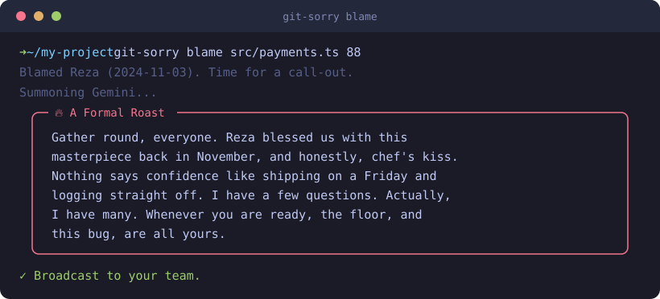

<p align="center">
  
</p>

<p align="center">
  
  
  
  
</p>

## What it does

We have all shipped a line of code we are not proud of. `git-sorry` finds out
who wrote it and turns the moment into a bit of theatre.

Point it at a file and a line number. It reads `git blame`, figures out whether
the culprit is you or a teammate, and asks Gemini to write the appropriate
response. If the line is yours, you get a dramatic apology worthy of the stage.
If it belongs to someone else, you get a playful roast that gently demands an
explanation. Either way the message lands in a tidy box in your terminal and
goes straight to your team on Slack or Discord.

It is a joke tool with a real workflow underneath. Bring your own keys, keep
them on your machine, and let the drama begin.

## A look at it

When the bad line is yours:

<p align="center">
  
</p>

When the bad line belongs to someone else:

<p align="center">
  
</p>

## Install

```bash
npm install
npm run build
```

## Set it up

You need a Gemini API key and one webhook URL. Both stay on your machine in
`~/.git-sorry/config.json`, saved with owner only permissions.

```bash
git-sorry config --set-key <GEMINI_API_KEY>
git-sorry config --set-webhook <SLACK_OR_DISCORD_WEBHOOK_URL>
```

Where to find them:

| Item | Where |
| :--- | :--- |
| Gemini API key | https://aistudio.google.com/app/apikey |
| Slack webhook | `https://hooks.slack.com/services/...` |
| Discord webhook | `https://discord.com/api/webhooks/...` |

## Use it

```bash
git-sorry blame <filepath> <line_number>
```

For example, to put line 42 of `src/auth.ts` on trial:

```bash
git-sorry blame src/auth.ts 42
```

If you wrote the line, expect an apology. If a teammate did, expect a roast.
The generated message prints in your terminal and posts to your chat at the
same time.

A few flags for when you want the last word:

| Flag | What it does |
| :--- | :--- |
| `--dry-run` | Print the message but keep it off the team channel. Handy for a first look, and it works without a webhook set. |
| `--roast` | Roast the author no matter who wrote the line. |
| `--apology` | Grovel instead, even if the line was not yours. |

```bash
git-sorry blame src/auth.ts 42 --dry-run
git-sorry blame src/auth.ts 42 --roast
```

## Try it locally with npm link

```bash
npm install
npm run build
npm link

git-sorry config --set-key <GEMINI_API_KEY>
git-sorry config --set-webhook <URL>
git-sorry blame path/to/file.ts 10

npm test

npm unlink -g git-sorry
```

## How it works

1. It checks that your Gemini key is set, and your webhook too unless you passed `--dry-run`.
2. It reads your local `git config user.name`.
3. It runs `git blame` on the line to get the author, the date, and the code.
4. It compares you against that author, unless `--roast` or `--apology` already made the call.
5. It prompts Gemini 2.5 Flash for an apology or a roast.
6. It prints the reply inside a boxen frame.
7. It posts the reply to your webhook. Slack reads the `text` field and Discord
   reads the `content` field, so one payload covers both.
8. It confirms the broadcast.

## Project layout

```
src/
  index.ts     CLI wiring and the full flow
  config.ts    local key and webhook storage
  git.ts       reads git user and parses git blame
  gemini.ts    builds the prompt and calls Gemini
  webhook.ts   posts the message to Slack or Discord
```

## Notes

- Native `fetch` is used for the webhook, so no HTTP client dependency.
- Config lives in a plain JSON file, so no extra config library.
- The one payload trick keeps Slack and Discord support to a single request.

## License

Released under the MIT License. See [LICENSE](LICENSE).
